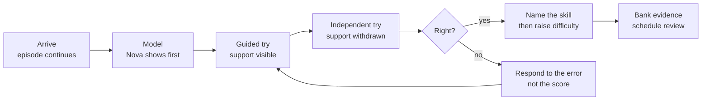

# CurioQuest: A Rethink

2026-09-20 · @Someone

## What I looked at

I read the CurioQuest checkout on your Desktop, not the docs alone: 263 source files, about 20,000 lines across `app/`, `components/`, `lib/` and `hooks/`, 18 hand-written CSS files totalling 239 KB, the Drizzle schema and the seven Supabase migrations, the 29 test files, and the QA screenshots in `outputs/`. I also read your own product documents — `PRODUCT_BLUEPRINT.md`, `COMMERCIAL-UPGRADE.md`, the fifteen wave briefs, `RELEASE_STATUS.md` and `EXPERIENCE_REVIEW.md` — so this plan argues with them rather than repeating them.

Two things are worth saying before the critique. First, this is not a weak codebase. The `lib/` layer is better than most funded ed-tech I have seen: a real skill graph with prerequisites, a mastery record that separates supported from independent success, learning bands that carry delivery rules rather than just labels, spaced review, and a recommender that explains why it picked each item. Second, your own review documents already name several of the problems below. Where that happens I say so and go further, because naming a gap in a document is not the same as having a plan that closes it.

The word "basic" in your message is the right diagnosis but the wrong location. The engineering is not basic. The *experience* is basic, the *content* is thin, and the *product* has no spine. Those are three different fixes and the rest of this document separates them.

## The diagnosis

CurioQuest is a competent web application wearing a children's theme. The nine problems below are ordered by how much they hold the product back, and every one of them is structural rather than cosmetic.

**1. The child-facing app is shaped like a SaaS dashboard.** `ExplorerShell` renders a 244px fixed sidebar with thirteen text-labelled destinations, a top bar, a breadcrumb trail ("Home / Reading Adventure") and a star counter in the corner. A five-year-old cannot read "Discovery Lab", cannot tell it apart from "Build Lab", and has no reason to prefer either. Navigation built from small text labels hands the steering wheel to the parent, which is the opposite of what an independent-play product needs. On the phone screenshot the entire thirteen-item grid sits above the fold before any content at all.

**2. The copy is written for the parent while the child is the one holding the tablet.** "SMALL STEPS. BIG DISCOVERIES.", "THREE PATHS TO GROW", "A sound. A word. A whole new world." This is landing-page rhetoric rendered inside the product. The child home has roughly 120 words of prose that a pre-reader cannot use, and one button they can.

**3. There is no world — only pages named after places.** Treehouse, Harbor, Meadow, Village and Lab are labels on cards in a vertical scroll. Children aged 3–8 build their mental model of software spatially: the same tree is in the same place every time, and going somewhere is a journey, not a route change. Every navigation metaphor in the product is currently written down rather than drawn.

**4. Three art systems are fighting.** One rendered island in `quest-island.webp`, thin Lucide line icons at 20–27px, and emoji used as content art (an ear for "Listen", a train for "Sound Bridge", a crayon inside a story scene). Nova the fox is genuinely charming and is the only piece of real character art in the product. Line icons read as *software*; this category reads as *toy*.

**5. The default learning interaction is a three-option multiple-choice question.** `lib/curriculum.ts` builds its bank from fourteen `add()` loops over word lists, each producing a prompt, one right answer, two wrong ones, a hint and an explanation. The specialist engines — ten-frame, number bond, blend train, sound boxes, route — are the good part and are outnumbered. Your own `CLAUDE.md` forbids "generic quiz-only learning experiences", and the shipping default is exactly that. A child who taps the correct picture has demonstrated recognition, which is the weakest evidence of learning there is.

**6. Content is source code, so content cannot scale.** Activities are TypeScript literals compiled into the bundle. The skill graph holds 78 nodes (68 active) against the blueprint's own target of 180–200. Adding a week of new material currently requires a developer, a pull request and a deploy. No author, teacher or illustrator can touch the product without you.

**7. The data model cannot answer the questions an adaptive product must ask.** `explorers` and `workspace_items` store everything as a JSON blob in a `data` text column. Reading attempts are the one exception and have a proper table with an index. This means you cannot ask "which skills do children fail most often", "does a child who masters blending here succeed there", or "which activity is badly written" — not with better SQL, but at all. Adaptivity without an event stream is a guess with good manners.

**8. The styling has no system.** 239 KB of hand-written CSS across eighteen files, with override blocks appended to the bottom of `globals.css`, 42 `!important` declarations, and font sizes hard-coded down to 6px in places. Meanwhile Tailwind v4, Radix and a full shadcn component set are installed and barely used on child screens. The practical cost is that every new screen is more expensive than the last one, and a real visual redesign currently means rewriting eighteen files.

**9. The product has no spine.** Thirteen destinations of equal weight, one daily quest, and nothing that says "you are somewhere in a story and this is the next bit." Nothing carries across sessions except a star count. Compare the category: [Khan Academy Kids](https://learn.khanacademy.org/khan-academy-kids/) is free with a calm path and a cast of characters, [ABCmouse](https://www.abcmouse.com/) ships a 10,000-activity step-by-step path, [Lingokids](https://lingokids.com/) sells production value and playlearning at roughly $15/month. A new entrant does not win by being a smaller version of all three.

One more, which is commercial rather than experiential: `RELEASE_STATUS.md` is honest that this is a single owner-private family workspace with no tenancy, consent flow, subscription or public registration. Every number below assumes that gap is closed deliberately rather than discovered late.

## The reframe

One sentence the whole product should obey: **a child opens CurioQuest, and the app already knows where they are in a story — it takes them there, and something happens.**

Not a menu. Not a home screen of thirteen equal doors. A place, a companion who greets them by name, and one obvious thing to do, with everything else reachable but subordinate. The current app asks a five-year-old to make a navigation decision before any learning happens; that decision is the single biggest thing standing between this product and the category leaders.

Four consequences follow, and they drive everything in the rest of this document.

**The map replaces the sidebar.** An illustrated world you move through, where the Reading Grove is always north-west and the Number City always has the tall clock tower. The sidebar survives only behind the parent gate.

**The episode replaces the session.** Children come back for a story that is unfinished, not for a skill that is unmastered. Wrap adaptive practice inside a serialised adventure — Nova needs three lantern crystals, and each one happens to be a phonics goal — so the learning spine is invisible to the child and fully legible to the parent.

**Producing beats answering.** Every tap-the-right-picture question you can convert into build it, say it, draw it, sort it, predict it or fix it is a strict upgrade in both engagement and evidence quality. The engines you already have (ten-frame, number bond, sound boxes, blend train, route) are the model; the multiple-choice bank is the thing to shrink.

**One subject done extraordinarily well beats six done adequately.** You currently spread 78 skills across six subjects. Khan Academy Kids is free, ABCmouse has 10,000 activities and twenty years of content debt paid off. You cannot out-breadth either. You can out-depth both in a narrow band, and the next section says which one.

## Who it is for

The positioning I would take: **the app that teaches a child to read, inside a story they want to come back to — and shows the grown-up exactly what changed this week.** Ages 4–7, reading first, everything else in orbit.

Reading is the wedge for four reasons. It is the outcome parents pay for and worry about, far more than counting. It has the clearest evidence base, so "science-informed" is a claim you can actually defend. It is the one place you already have depth — the Reading Adventure slice with placement, Letter Catch, Blend Train, Sound Boxes and decodable text is the strongest work in the repository. And it is the hardest thing to copy, because good phonics needs authored audio, sequenced decodables and real instructional judgement, which is exactly what a competitor cannot generate cheaply.

Math stays, because parents expect it and you have good manipulative engines. Science, logic, creativity, stories, building and faith stay as *enrichment* — valuable, differentiating, but not carrying the mastery claim and not competing for the child's first tap. That is a demotion in navigation, not a deletion of work.

The buyer and the user are different people, and the product needs to satisfy both without confusing them:

|  | The child (4–7) | The parent |
| --- | --- | --- |
| Wants | A companion, a story, something to show off | Proof their child is learning, and quiet time that isn't guilt-inducing |
| Judges it by | Whether it is fun in the first 45 seconds | Whether week three looks different from week one |
| Fails when | Reading is required to navigate; nothing changes between visits | The dashboard shows activity counts instead of progress in plain words |
| Needs from CurioQuest | A place, a face, a voice, and one next thing | A weekly two-minute read and one specific thing to do off-screen |

What to stop trying to be: a six-subject curriculum suite, a content library measured in thousands of activities, and a general "family learning application". Those are ABCmouse's fights, and they are won with capital and catalogue, not craft.

One strategic choice worth making early, because it changes the build: whether the Ethiopian and diaspora market is a first-class target or a later localisation. An English-plus-Amharic early-reading app with culturally native stories and characters is a defensible niche that no incumbent serves — but bilingual phonics is a real content commitment, not a translation pass, and it should be decided before content production starts rather than after.

## The learning model

Your skill graph, mastery record and spaced review are the right bones. Three things are missing: evidence that means something, interactions that produce it, and content that actually changes with age.

### Mastery needs three different kinds of evidence, not more correct taps

Today a skill's score rises with correct answers, with `independentCorrect` and `hintCount` tracked separately — which is already ahead of most products. Make that explicit as a rule: a skill is not mastered until the child has shown it **in a different representation, on a different day, without support.**

- *Different representation* — they heard /m/ in a word, and they also chose the letter, and they also built a word that starts with it. `activityTypes` already records this; make it a gate rather than a statistic.
- *Different day* — `nextReviewAt` exists; enforce that at least one success falls after a gap of 24 hours or more.
- *Without support* — `consecutiveIndependent` exists; require it.

The difference matters commercially, not just pedagogically. It is what lets a parent report say "Maya can blend three-sound words on her own, a week after she learned it" instead of "Maya completed 42 activities."

### Replace recognition with production

A taxonomy to author against. Each verb below produces stronger evidence than a three-option choice, and each one already has a partial engine in your repository.

| Verb | What the child does | Existing engine to build on |
| --- | --- | --- |
| Say | Speaks a sound or word; the app listens | None — new, and the highest-value addition for reading |
| Build | Assembles letters, a number bond, a pattern | `word-builder`, `number-bond`, `ten-frame` |
| Sequence | Orders sounds, steps, events, a route | `ordering`, `route`, `blend-train` |
| Sort | Groups by an attribute they must infer | `sorting`, `matching` |
| Predict | Commits to an outcome before seeing it | `investigation` in Discovery Lab — the best-designed loop you have |
| Fix | Finds and repairs a deliberate error | None — cheap to add, excellent for metacognition |
| Explain | Chooses or records *why*, after answering | None — turns a correct tap into transferable knowledge |
| Make | Draws, writes, records something of their own | Creative Studio |

Target mix: no more than a quarter of any quest as multiple choice, and never two in a row.

### The loop, with the teaching moves named

The part worth engineering hardest is the box labelled *respond to the error*. A child who picks `b` for `d` has a reversal problem; a child who picks `m` has not heard the sound. Same wrong answer count, completely different teaching response. Author distractors with a reason attached — `confusable-visual`, `confusable-sound`, `off-by-one`, `attends-to-wrong-attribute` — and let the response, the hint and the next item all branch on which one they picked. This is a content-authoring discipline more than a code change, and it is the single highest-leverage pedagogical upgrade available to you.

### Make age adaptation real

`learning-bands.ts` defines six bands with genuinely thoughtful delivery profiles — narration mode, maximum choices, touch-target size, hint latency, session length. Then `ContentBand` collapses all six onto two authored pools, `prek` and `grade1`. So a three-year-old and an eight-year-old receive the same items with different wrappers. Either author for the bands you claim, or claim the bands you author for; the second is cheaper and more honest. My recommendation: narrow the public promise to ages 4–7, author three real content bands inside it, and let the delivery profiles do the fine-grained adaptation they were designed for.

### The voice problem

`lib/speech.ts` uses the browser's `speechSynthesis`. For a phonics product this is a correctness issue, not a polish issue: synthetic voices routinely mangle isolated phonemes, say the letter name where the sound is meant, and vary by device and browser. Authored audio for the phoneme set, the decodable word list and Nova's scripted lines is a prerequisite for claiming to teach reading. Keep synthesis as the fallback for incidental text only.

## Experience and interface

### Three surfaces, three different design languages

The app currently uses one visual language — a soft web dashboard — for a four-year-old, a nine-year-old and a parent. Split it.

| Surface | Who | Language | Rule |
| --- | --- | --- | --- |
| The World | Child, arriving | Illustrated map, full-bleed, no chrome | Nothing on screen a pre-reader cannot use |
| The Stage | Child, learning | Full-screen, one activity, no navigation at all | One idea per screen; exit is a single obvious door |
| Grown-ups | Parent | Calm, dense, familiar web patterns | This is where your shadcn components belong |

The sidebar, breadcrumbs and star pill stay — in Grown-ups. On child surfaces they go.

### Navigation a non-reader can drive

Five rules, in priority order. One big thing: the child's next episode occupies at least half the first screen and needs no reading to start. Picture first: every destination is a drawn place with a distinct silhouette and colour, and the word underneath is a label, not the control. Voice on touch: touching a place says its name in Nova's voice before committing — this is how pre-readers learn a menu. Five doors, not thirteen: World, Stories, Games, Make, My Treehouse; Discovery Lab, Build Lab, Team Quest, Reading Adventure and Faith become *places inside the world*, reached from the map. And the same thing in the same place, every time — no reordering by recency or recommendation.

### Art direction: pick one and enforce it

Delete emoji from every child-facing surface, and Lucide icons from every child-facing surface. Both are placeholders that shipped.

Commission one illustrated world: a single flat-vector style with soft depth, one palette of roughly twelve colours, and a cast of four — Nova (guide), Pip (curiosity, already there), plus one peer character the child's age and one gentle antagonist-of-friction for stories. Every destination, reward object and story scene is drawn in that style. This is the largest single cost in the plan and the one that most changes how the product is perceived in the first ten seconds. Budget for an illustrator for three to four months rather than buying a stock asset pack, which will read as generic precisely because it is.

Type is a literacy decision, not a taste one. Body text for early readers should use an infant/single-story `a` and `g` — the letterforms children are taught to write — at a minimum of 20px for ages 4–5 and 18px for 6–7, with generous line height. The current app has 12px labels and a 6px override in `globals.css`. Use `app/fonts.ts`, which exists and is bypassed by a `'Trebuchet MS'` stack.

Colour should carry meaning: one hue per world, held consistently across map, episode and reward, all text meeting WCAG AA against its own background. The current sage-and-cream palette is tasteful and a little tired; keep it as the *parent* palette and let the child world be brighter and more saturated.

### Motion, sound and touch

Motion should mean travel and reaction, not decoration: the map pans to the place you chose rather than the route changing under you; Nova breathes, blinks, reacts to a right answer and to a wrong one differently. `prefers-reduced-motion` is already handled globally — keep that and make the reduced path still feel finished.

Sound is half the experience in this category and is currently the weakest half. Each world needs a quiet ambient bed, a small set of earcons (correct, not-yet, collect, unlock), and authored voice. `lib/audio.ts` already ducks music under voice, which is the hard part.

Touch targets: the bands define 44–64px; honour the top of that range for ages 4–5, place primary actions in the lower two-thirds of a tablet screen where small hands rest, and design landscape-first on iPad, which your own `CLAUDE.md` names as the primary device.

### Rewards that mean something

Stars are a number that goes up; children under seven care far more about *things they can see and arrange*. My Treehouse already exists and is the right answer — promote it to the reward system. Finishing an episode brings back an object, the object is placed in a space the child controls, and the space visibly fills over weeks. That is a progress bar a five-year-old can read, and it is also the thing they drag a parent over to look at.

What not to build: streaks with loss pressure, daily login rewards, variable-ratio surprise mechanics, or anything that makes stopping feel like a punishment. Aside from being wrong for this age, the design of engagement mechanics aimed at children is now a live regulatory question in several markets, and "we never built it" is a much better position than "we removed it."

### Make the redesign visible before you build it

Before any of this reaches the codebase, produce a clickable prototype of five screens — arrival, map, episode start, one activity, treehouse — and put it in front of four or five children aged 4–7. Watch whether they can start without being told. That test costs a week and will change the plan.

## Content architecture

Content has to leave the bundle. As long as an activity is a TypeScript literal, the ceiling on this product is your own commit rate, and no teacher, writer or illustrator can contribute. You have already started the move — the three curriculum migrations carry a few thousand insert statements into Supabase — so finish it and make the database the source of truth, with the code reading a published, versioned catalogue.

### The objects to model

| Object | Holds | Why it is separate |
| --- | --- | --- |
| Skill | The teachable thing, prerequisites, evidence target | Already exists in `skill-graph.ts`; move it to data |
| Lesson | One skill taught: model → guided → independent → review | The missing layer — today items float free of any teaching sequence |
| Item | A single interaction, its verb, its assets, its distractors and *why each is wrong* | Lets feedback and difficulty branch on the error |
| Episode | The story wrapper that orders lessons into a narrative arc | The retention layer the product currently lacks |
| Asset | Audio, illustration, animation, with locale and licence | Audio must be addressable per phoneme and per locale |
| Review record | Who checked this item, when, and its status | Lets you gate unreviewed content instead of shipping it quietly |

### Authoring

Build a small internal authoring surface rather than adopting a general CMS: content types this specific are badly served by generic editors, and you already have the component library and auth to build one cheaply. The minimum that works is a spreadsheet-shaped bulk import, a per-item editor with a live preview that renders the item exactly as the child sees it, and a publish step that validates the whole catalogue with Zod before it becomes visible. Preview is the part people skip and regret — an author who cannot see the item cannot judge it.

A publish should also be atomic and versioned. Your recommender already guards against catalogue drift by selecting from the served pool; a versioned catalogue makes that guarantee structural rather than defensive.

### How much content is actually needed

The blueprint's 180–200 skills is the right order of magnitude for the full promise; it is the wrong first target. For the reading-first wedge, ages 4–7:

| Layer | Target for a credible v1 | Where you are |
| --- | --- | --- |
| Reading skills, sequenced | 60–80 | 18 |
| Items per skill (across 3+ verbs) | 12–20 | \~4, mostly one verb |
| Decodable texts, phase-aligned | 40–60 | 1 |
| Recorded audio lines (phonemes, words, Nova) | 2,000–3,000 | 0 authored |
| Episodes (8–12 lessons each) | 12–16 | 0 |
| Math skills as supporting track | 40–50 | 19 |

That is roughly 1,000–1,400 authored items, not 10,000. Depth in a narrow band is the strategy; breadth is what you are deliberately not buying.

### Where AI earns its place, and where it does not

Use a model to draft item variants from a skill and a word list, to propose distractors with reasons attached, to write first-pass story scenes in Nova's voice, and to flag items whose reading level drifts above their band. Have a human approve every one before publish — the review record above is what makes that auditable.

Do not put a live generative tutor in front of a five-year-old. Nova should stay authored, which is what `docs/ai/NOVA_SPEC.md` already commits to. The risk is asymmetric: the upside is a slightly better hint, the downside is an unpredictable utterance to a child, and it is unsellable to the parent who has to approve it.

One content decision worth taking now: author everything with a locale key and keep text out of illustrations from the first asset. Retrofitting localisation into a drawn world is expensive; designing for it costs nothing today.

## Engineering

### Settle the stack before adding to it

The repository is currently two applications in a trench coat. `package.json` is still named `site-creator-vinext-starter` and carries Vinext, Wrangler, the Cloudflare Vite plugin and `vite.config.ts` alongside Next 16 and a Vercel project. `db/schema.ts` defines a SQLite/D1 schema with Drizzle while `supabase/migrations/` defines the real Postgres one. `README.md` spends most of its length documenting a Cloudflare Sites starter that is no longer how the app runs.

Pick Next on Vercel with Supabase — which is what you are actually running — and delete the other half: Vinext, Wrangler, the D1 schema, `vite.config.ts`, `examples/`, and the starter documentation. Rename the package. This is a day of work that removes a permanent source of confusion for every future contributor, human or agent.

### Give learning its own event stream

The most important schema change in this document: an append-only `learning_events` table — one row per attempt, with child, skill, item, verb, correct, support level, chosen distractor, latency, session, timestamp. Mastery becomes a projection over those events rather than a JSON blob that is mutated in place.

This single change unlocks the parent report, the item-quality report ("84% of children pick this distractor — the item is broken"), the retention analysis, and any future claim about effectiveness. It is also the thing that is hardest to add retroactively, because events you did not record are gone. Keep JSON columns for child-generated artwork and free-form creations, where the shape genuinely varies; get structured data for everything the adaptive engine reads.

Hold the line you have already drawn on RLS and server-side answer checking — the commit that stopped shipping answers to the browser was the right instinct, and it should extend to anything that gates a reward.

### Retire the CSS by attrition

Do not rewrite 239 KB of CSS in one pass. Define the token layer properly in `tokens.css` (colour, type scale, spacing, radius, motion, touch targets), build the new child components against tokens and Tailwind only, and let each redesigned screen delete its old stylesheet. The eighteen files should shrink screen by screen, and the 42 `!important` declarations are a good progress metric on their own.

### Tablet, offline, and the app stores

iPad is the stated primary device, so two things follow. First, offline: a service worker that caches the current episode's assets and queues learning events for replay covers the car, the aeroplane and the patchy connection, and it is the single most requested feature in this category's reviews. `app/manifest.ts` already exists, so the PWA path is short.

Second, distribution: parents look for children's apps in the App Store and Google Play, not on the open web, and in-app purchase is how they expect to subscribe. A wrapper around the web app (Capacitor is the low-friction route from here) is worth planning for around the point you have something to charge for — not before, and not as a rewrite.

### Performance and craft

`public/og.png` is 2.9 MB and `public/game-zone.png` is 3.1 MB. On a home tablet on a slow connection, that is the first impression. Move every raster to AVIF/WebP with responsive sizes, budget the arrival screen to under 300 KB of images, and treat time-to-first-tap — arrival to the child being able to touch something that responds — as a tracked metric with a target under two seconds.

### Testing what actually breaks

The 29 Node test files cover logic well. What is untested is everything a child touches: layout at real device sizes, contrast, focus order, touch target size, audio behaviour when narration is off, and the reduced-motion path. Add Playwright coverage on a small device matrix with automated accessibility checks, and screenshot comparison on the five core screens. `scripts/ui-shots.mjs` already exists as a starting point.

For observability, prefer aggregate counters and error tracking over session replay. Recording a child's screen is a conversation with a parent you do not want to have, and the amended COPPA rule makes broad collection meaningfully riskier.

## The grown-up layer

Parents renew subscriptions for one reason: they believe the thing is working. Nothing in a child's session communicates that, so the parent surface carries the entire commercial weight of the product. Yours is thorough — controls, evidence, export, an activity builder — and it is written in the language of the system rather than the language of a parent.

### One screen, four answers

The weekly view should answer four questions and stop:

1. **What is new this week?** One sentence, specific: "Maya can now blend three-sound words on her own." Not a count of activities.
2. **What is she working on?** The current skill, in plain words, with where it sits in the sequence.
3. **What is stuck?** One thing, with the reason: "She hears the sounds but mixes up `b` and `d` when she sees them." This is what the distractor-reason model in the learning section buys you.
4. **What can I do in five minutes, off the screen?** One concrete activity tied to the stuck thing. Your `offscreenInvitation` already does a version of this — make it the emotional centre of the report rather than a footnote.

Everything else — controls, portfolio, history, export, the activity builder — moves one level down. A parent who wants depth will find it; a parent who has ninety seconds should not have to.

### Plain words, not system words

A glossary rewrite is cheap and changes perception disproportionately. "Skill LIT.PK.PA.BLEND\_01: 62% mastery, 4 attempts" becomes "Putting sounds together to make words — nearly there, and she is doing it without help about half the time." Never show a percentage without a sentence that says what it means.

### Say what you do not know

Your release notes are unusually honest about the difference between practice and mastery. Keep that in the product itself: "practised 12 times" and "can do this independently" are different claims, and a parent who later discovers you conflated them will not trust the next report. Honesty here is also the cheapest defence against the regulatory question of unsubstantiated educational claims.

### Siblings and teachers

Team Quest is a genuine differentiator that almost nothing else in the category has — two children in the same family learning together, at different levels. That is worth far more product attention than Faith, Build Lab or the activity builder, and it is the kind of feature a parent describes to another parent.

A classroom or homeschool-group view is a real adjacent market, but it needs its own roster, assignment and privacy model. Note it as a later track, not a v1 feature.

## Trust, safety and compliance

The amended COPPA Rule has been in full force since **22 April 2026**, and the FTC is now enforcing rather than warning. Civil penalties run to $53,088 per violation, counted per child and per day. This is not a launch-week checklist item; two of its provisions change decisions made in this document.

**Voice is now biometric data.** The amended definition of personal information explicitly covers voiceprints. The "Say" verb I recommend in the learning model — the single highest-value addition for reading — therefore needs a deliberate design: run recognition on-device where possible, never retain raw audio, store a pass/fail judgement rather than a recording, and say all three plainly in the privacy notice. Designed that way it is an asset; designed carelessly it is the riskiest feature in the product.

**Third-party sharing needs its own consent.** Consent to collect is no longer consent to disclose. Practically, this means no third-party analytics, advertising or A/B tooling inside a child session — which is a reason to keep telemetry first-party and aggregate, as the engineering section recommends.

The rest of the obligations are ordinary work, and doing them early is much cheaper than retrofitting:

- A **written data retention policy** with maximum retention periods tied to purpose, and actual deletion. This is a first-time requirement, not a restatement.
- A **privacy notice** listing each category of data, its purpose, its retention period, and any third-party recipients by name or category.
- **Verifiable parental consent** at sign-up, and a parent-facing way to review and delete a child's data. Your parent gate and export are a good foundation.
- **Data minimisation as a design rule.** A child profile needs a first name, an avatar and a band. It does not need a birth date, a photo, or a surname.
- Seventeen of twenty state privacy laws extend protections past age 13, so age bands in the data model should be structural rather than cosmetic.

Two further things sit alongside the legal minimum. If you distribute through the app stores, the Kids categories impose their own rules on ads, external links and purchase flows — read them before designing the subscription screen, not after. And any claim that the product improves learning outcomes is an advertising claim: "built on evidence-based practice" is defensible today; "improves reading scores by X" requires a study you have not run. Your own release notes already make that distinction — hold it in the marketing too.

The ethical layer is not in any statute but belongs in the same section: no ads, no streak-loss pressure, no surprise-reward mechanics, session-length limits that the app itself respects, and an ending to every session that feels like a good stopping point rather than an interruption. For a product sold to parents on trust, these are features, not restraints.

Sources: [PrivacyLawMap — COPPA rule amendments and 2026 checklist](https://privacylawmap.com/blog/coppa-rule-amendments-april-2026-compliance-checklist), [Finnegan — COPPA's amended rule in full effect](https://www.finnegan.com/en/insights/articles/coppas-amended-rule-is-now-in-full-effect-what-operators-need-to-know.html), [Screenwise — Lingokids vs ABCmouse vs Khan Academy Kids](https://screenwiseapp.com/guides/lingokids-vs-abcmouse-vs-khan-academy-kids-which-learning-app-is-best).

## Roadmap

Four phases. Each one ends with something you can put in front of a real child or a real buyer, because the failure mode for a project this well-documented is another six months of internal waves.

### Phase 0 — Decide and clear the ground (2 weeks)

Clickable prototype of the five core screens; four to five play sessions with children aged 4–7; the stack cleanup (delete Vinext, Wrangler, D1, the starter README); `learning_events` designed and shipped so real data starts accumulating; and two decisions made on paper — the age promise (I recommend 4–7) and whether Amharic is v1 or later.

*Proves:* whether children can start unaided, and which of the thirteen destinations they ever ask for.

### Phase 1 — The world and the episode (roughly 3 months)

The new child shell: illustrated map, no sidebar, five doors, voice-on-touch. One world drawn properly — the Reading Grove — with Nova animated and a first ambient soundscape. Three complete episodes of 8–12 lessons each, built on the existing phonics slice, with authored audio for the phase-one phoneme set. The item model with distractor reasons, and error-responsive feedback wired to it. Content moved into Supabase with a first authoring surface. The parent weekly view rewritten to the four questions.

*Proves:* that a child returns across a week without being sent, and that a parent can say what changed.

*Needs:* an illustrator (3–4 months), a voice recording budget, and a few hours a week from an early-literacy specialist reviewing the sequence.

### Phase 2 — Depth and belief (months 4–7)

The full reading sequence to 60–80 skills with 12–20 items each. The "Say" verb with on-device recognition and no audio retention. Offline via service worker with queued events. Treehouse promoted to the reward system. Team Quest rebuilt as a headline feature. Math reduced to a supporting track and brought up to the same interaction quality. Closed beta with 20–50 families outside your own.

*Proves:* retention beyond novelty, and whether the mastery model matches what parents observe at home.

### Phase 3 — Commercial (months 8–12)

Multi-family tenancy, verifiable parental consent, retention policy, subscription billing, and app-store distribution via a wrapper. Pricing is a positioning statement: Khan Academy Kids is free and ABCmouse sits near $13/month, so a premium reading-first product lands around $8–12/month or $60–80/year, and should be sold on the weekly parent report as much as on the child experience.

*Proves:* whether anyone pays, and at what price the trial-to-paid conversion holds.

### What to freeze

For the whole of Phases 0 and 1: no new subject areas, no new destinations, no new game types, and no further wave documents. The blueprint is not short of scope — it is short of depth in the scope it already has. Faith, Build Lab, Theater and the parent activity builder keep working and receive no new investment until the reading spine is finished.

## How to tell it is working

Six numbers. Everything else is diagnostic detail that belongs in a query, not on a dashboard.

| Metric | What it really asks | Where you want it |
| --- | --- | --- |
| Unassisted starts | Can the child begin without a parent? | Above 80% of sessions by the end of Phase 1 |
| Return days per week | Is the episode pulling them back? | 3+ days for an engaged family |
| Independent mastery per week | Is anything actually being learned? | 2–3 skills, evidenced across verbs and days |
| Retention at 14 days | Does mastery survive the gap? | Above 70% of reviewed skills passing |
| Parent weekly open rate | Does the grown-up believe it? | Above 50% of active families |
| Item health | Which content is broken? | Flag any item where one distractor takes over 60% |

The last one is the quiet workhorse. With the event stream in place it runs automatically and tells you which items to rewrite — that is how a content library gets good, and it is not available at all today.

What I would deliberately not measure: total time in app, activities completed, and stars earned. Each of them rises when the product gets worse in exactly the ways this document warns about, and reporting them to parents trains them to value the wrong thing.

### Things to stop doing

Writing more wave documents before the last one is visible on a screen. Adding subjects. Counting activity configurations as though they were skills. Shipping emoji as artwork. Treating a correct tap as evidence of learning. And describing the product as "commercial-grade" in documentation while it is a single-family workspace — your release notes already resist this, and the resistance should hold.

## Start here

The next two weeks, in order. Nothing here needs a hire or a budget approval.

- [ ] **Watch a child use it.** One session, 4–7 years old, no coaching, no explaining. Note every moment they ask "what do I press?" This will reorder everything below, and it costs an afternoon.
- [ ] **Write the age promise down.** One line: who this is for and what it teaches them. Put it at the top of `CLAUDE.md`, above the wave list.
- [ ] **Ship `learning_events`.** Append-only, written on every attempt, alongside the existing mastery blob. Nothing depends on it yet; every later claim does.
- [ ] **Clear the stack.** Delete Vinext, Wrangler, `vite.config.ts`, `db/schema.ts`, `examples/` and the starter half of `README.md`. Rename the package from `site-creator-vinext-starter`.
- [ ] **Prototype the arrival.** One screen, not in the codebase: the illustrated map with five doors, Nova greeting the child by name, one episode waiting. Show it to the same child.
- [ ] **Kill the emoji.** Replace every emoji used as content art on child screens with drawn placeholders — even rough ones. It is a small change that makes the real gap obvious to everyone looking at the product.
- [ ] **Rewrite one parent report by hand.** Take a real week of one child's data and write the four answers as sentences a parent would want. That handwritten page becomes the spec for the screen.

The encouraging part of this audit: almost nothing needs to be thrown away. The skill graph, mastery model, bands, recommender, reading slice, Discovery Lab loop and Team Quest are all sound work. What they are missing is a world to live in, a story to hang on, a voice to speak with, and content produced by people other than you. That is a design and production problem more than an engineering one — which, given how the engineering has gone so far, is good news.
